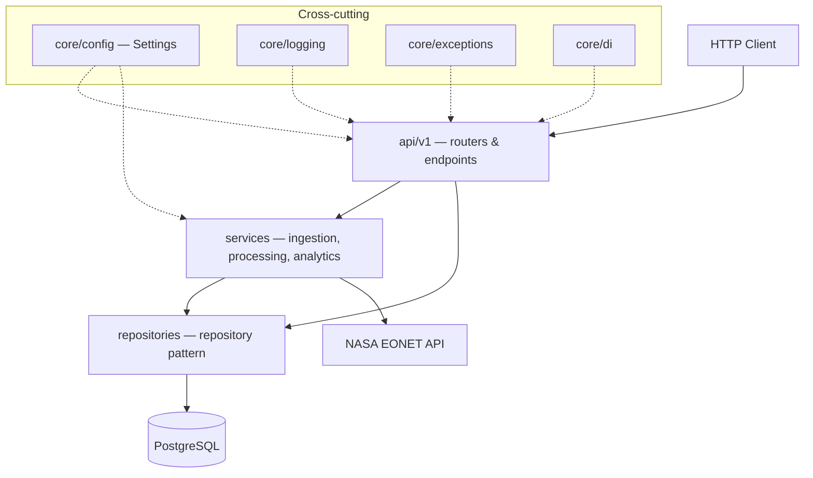
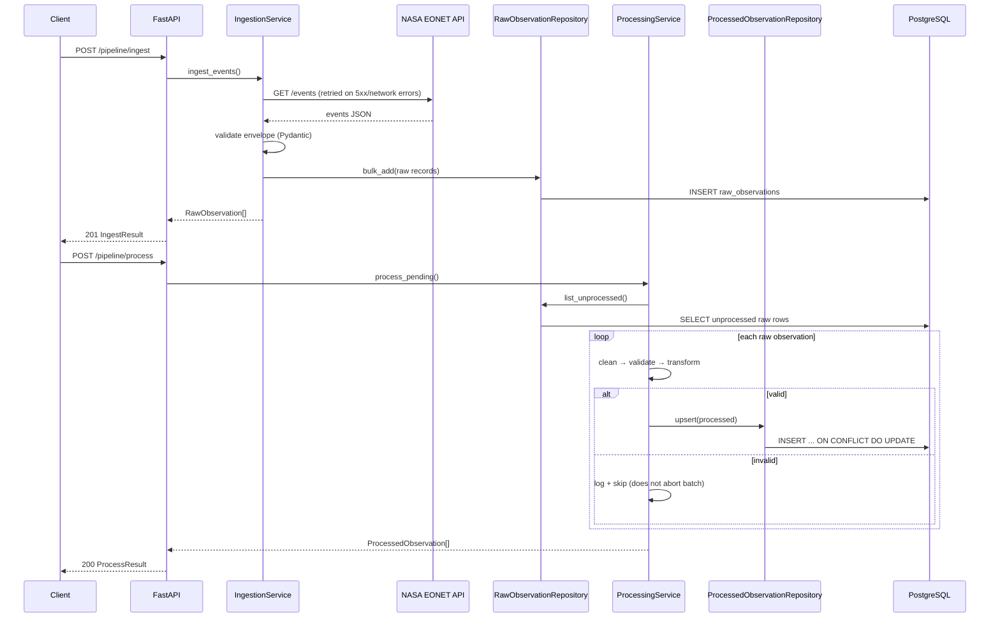
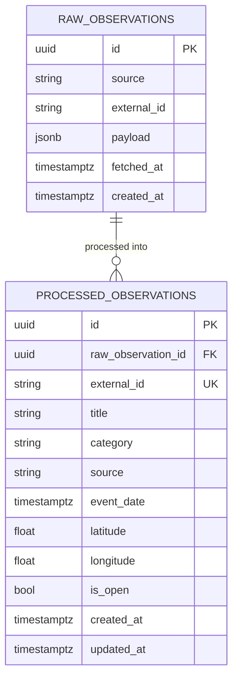

# Architecture

## Layering

Requests flow strictly downward; no layer constructs its own collaborators —
everything is wired through FastAPI's `Depends` (`core/di.py`).

CRUD endpoints with no business logic beyond persistence and 404 handling
(`raw-observations`, `processed-observations`) call repositories directly,
skipping the service layer — adding a pass-through service there would be an
abstraction with no purpose. Ingestion, processing, and analytics have real
orchestration logic and go through a service.

## Data flow: ingest → process → serve

## Database schema

